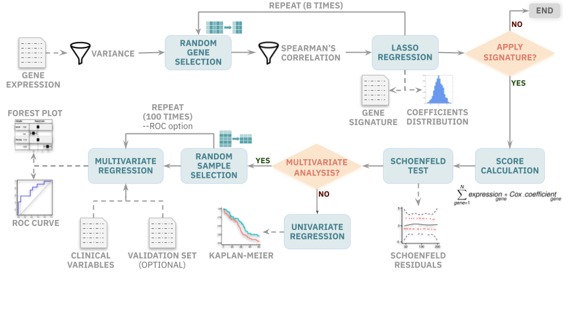

## Contents

1. [Overview](#overview)
2. [Installation](#installation)
3. [Dependencies](#dependencies)
4. [Command and options](#usage-and-options)
5. [Toy example](#toy-example)

## Overview

Reboot is a flexible, easy-to-use tool to identify sets of genes or transcripts whose expression values are highly correlated with patient survival. Using a multivariate strategy with penalized Cox regression (Lasso method), reboot presents efficient convergence of the regression coefficients during the creation of a gene/transcript signature. Once a signature is obtained, reboot also provides functionality to produce, apply and validate a score, which is calculated based on the obtained signature, for a given set of samples.

Reboot is a modular tool developed in R version 3.6. It comprises two main modules: **regression** and **survival**. Module **regression** provides functionality for obtaining gene/transcript signatures correlated with patient survival using multivariate penalized Cox regression. In turn, module **survival** provides functionality for producing, applying and validating a signature score in patient datasets. Finally, reboot also provides the execution option **complete**, which integratively executes the two aforementioned modules.


*Figure 1: Reboot workflow. First module runs a regression analysis to identify a gene/transcript signature. Second module runs survival analysis of a score calculated based on the obtained signature*

## Installation

Reboot can be obtained from github and installed via docker container (recommended) or through direct installation.

1. Via docker
	
	This method works on any distribution or operational systems, as long as [docker](https://docs.docker.com/install){:target="_blank"} is installed.

	```docker pull galantelab/reboot```

2. Direct

	This method requires previous installation of  [R version >= 3.6](https://cran.r-project.org/doc/manuals/r-devel/R-admin.html){:target="_blank"}:

	```git clone https://github.com/galantelab/reboot.git```


	```sudo sh reboot/install.sh```


## Dependencies

In order to work properly, the following packages are necessary (included in the installation procedures):

* [argparse](https://cran.r-project.org/web/packages/argparse/index.html){:target="_blank"}
* [BiocManager](https://cran.r-project.org/web/packages/BiocManager/vignettes/BiocManager.html){:target="_blank"}
* [BioinformaticsFMRP/TCGAbiolinks](https://github.com/BioinformaticsFMRP/TCGAbiolinks){:target="_blank"} (from BiocManager)
* [data.table](https://cran.r-project.org/web/packages/data.table/index.html){:target="_blank"}
* [extrafont](https://cran.r-project.org/web/packages/extrafont/index.html){:target="_blank"}
* [forestmodel](https://cran.r-project.org/web/packages/forestmodel/index.html){:target="_blank"}
* [hash](https://cran.r-project.org/web/packages/hash/index.html){:target="_blank"}
* [OptimalCutpoints](https://cran.r-project.org/web/packages/OptimalCutpoints/index.html){:target="_blank"}
* [optparse](https://cran.r-project.org/web/packages/optparse/index.html){:target="_blank"}
* [penalized](https://cran.r-project.org/web/packages/penalized/index.html){:target="_blank"}
* [remotes](https://cran.r-project.org/web/packages/remotes/index.html){:target="_blank"} (from BiocManager)
* [R.utils](https://cran.r-project.org/web/packages/R.utils/index.html){:target="_blank"}
* [sjlabelled](https://cran.r-project.org/web/packages/sjlabelled/index.html){:target="_blank"}
* [sjmisc](https://cran.r-project.org/web/packages/sjmisc/index.html){:target="_blank"}
* [sjstats](https://cran.r-project.org/web/packages/sjstats/index.html){:target="_blank"}
* [survcomp](http://www.bioconductor.org/packages/release/bioc/html/survcomp.html){:target="_blank"} (from BiocManager)
* [survival](https://cran.r-project.org/web/packages/survival/index.html){:target="_blank"}
* [survivalROC](https://cran.r-project.org/web/packages/survivalROC/index.html){:target="_blank"}
* [survminer](https://cran.r-project.org/web/packages/survminer/index.html){:target="_blank"}
* [tidyverse](https://cran.r-project.org/web/packages/tidyverse/index.html){:target="_blank"}

## Commands and options 

Reboot works with a command/subcommands structure:

```reboot.R [subcommand] <options>```


Subcommands may be invoked by the help menu:

```docker run --rm galantelab/reboot reboot.R -h```  , optionally:

```reboot.R -h```


In summary, 3 subcommands are available:


| **regression** | generates signature through multivariate Cox regression |
| **survival** | applies signature score in survival analysis |
| **complete** | generates signature and applies signature score in survival analysis| 

<br>

## Generation of gene/transcript signatures

   Reboot produces a genetic signature (significance coefficients) correlated with patient survival based on a multivariate Cox regression of genes and/or transcripts. This module uses a lasso algorithm combined with a bootstrap approach for dealing with possible dimension vulnerability (especially if attributes/instances ratio is high). 
   Filters for minimal variability of the attributes are also implemented. The analysis starts off checking and removing attributes with variance lower than the defined cut-off. Moreover, a spearman correlation filter is applied to every iteration of the bootstrap proccess based on the settable fraction of pairs with correlation coefficient higher than 0.8 and p-value lower than 0.05. 
   It is recommended a high attribute coverage for the analysis, considering the number of iterations and the group size of each iteration. Given a total number of attributes (N), group size (G) and number of iterations (B), the attribute coverage (AG) is given by: AG = (B * G) / N 

### Usage

   To generate a genetic signature, run the following: 


   ```docker run --rm galantelab/reboot regression <options>``` , optionally:


   ```reboot.R regression <options>```


   Regression options are: 


   | short option | full option | Description|
   | -------------------------- | ----------------------------------------- | ----------------------- |
   | -I | -\-filein | Input file name. Tab separated values (tsv) file containing genes/transcripts expression and survival paramenters |
   | -O | -\-outprefix | Output file prefix. Default: reboot |	
   | -B | -\-bootstrap | Number of iterations for bootstrap simulation (int). Default: 1 |
   | -G | -\-groupsize | Number of genes/transcripts to be selected in each bootstrap simulation (int). Default: 3 |
   | -P | -\-pcentfilter | Percentage of correlated gene/transcript pairs allowed in each iteration. Default: 0.3 |
   | -V | -\-varfilter | Minimum normalized variance (0-1) required for each gene/transcript among samples (double). Default: 0.01 |
   | -h | -\-help      | Show this help message and exit |

   <br>	

### Input
		
   To produce a genetic signature, reboot requires a tsv file containing normalized expression values (TPM or FPKM) for genes/transcripts across multiple samples, in addition to survival data: survival status (e.g., 0=dead or 1=alive) and follow up time:

   | Sample ID | OS | OS.time | PARPBP | RAD51 | ... |   
   |---|---|---|---|---|---|
   | patient_1 | 1 | 448 | 41.81557 | 34.70869 | ... | 
   | patient_2 | 0 | 466 | 24.78227 | 64.80153 | ... |
   | ... | ... | ... | ... | ... | ... |

   <br>   

### Output

   As result, reboot generates one log file, a tsv file containing regression coefficients and 2 plots. The tsv file is in the following format:
	
   | Feature name | coefficient | 
   | --- | --- |
   | PARPBP | 0.17014 | 
   | CXCR6 | 0.22173 |
   | ... | ... |
 
   <br>

   The output plots include a histogram with the distribution of the regression coefficients and a lollipop plot with the most relevant coefficients.

## Application of gene/transcript signatures in survival

   Reboot produces and applies a score for all samples based on the signature previously obtained from the **regression** module. Note that, at this step, a different sample set may be provided for validation purposes, for example.

   By default, both univariate and multivariate survival analyses use the median score value as cutoff to stratify patients in high and low score signatures, unless the ROC option is chosen. In that case, the cutoff value is based on the ROC curve using NNE (Nearest Neighbour Estimate) method and the Youden statistics, where J = [sensitivity + (specificity -1)]. If more than one J coefficients is present, then the first one is chosen.
   
   Reboot also offers the multivariate option, where other clinical variables such as therapy, age, gender, among others can be included in a multivariate survival model. Multiple univariate analysis are performed and only variables with a p-value <= 0.2 are selected for the final multivariate model. Statistical tests are performed in order to evaluate the relevance of the signature score along with co-variables as prognostic factor of a given event (overall / progression-free / recurrence-free survival).

   Additionally, if the ROC option is chosen along with the multivariate option, the multivariate analysis is done with a bootstrap resampling method once the clinical dataset provided passes the filters: (i) final dataset with at least 70% of the original one (NAs filter) and; (ii) the frequency of the less abundant category for each co-variable is not less than 20% (proportion filter). Otherwise, a multivariate analysis is performed without the bootstrap method. After 100 iterations, the relevance frequency of each co-variable with the event is calculated. Several plots are drawn for variables whose frequencies are at least 25%.

### Usage

   To validate a gene/transcript signature in survival analysis, run the following:


   ```docker run --rm galantelab/reboot reboot.R survival <options>```, optionally:


   ```reboot.R survival <options>```


   Survival options are:

   | short option | full option | Description|
   | ------------------------ | --------------------------------------- | ----------------------- |
   | -I | -\-filein | Input file name. Tab separated values (tsv) file containing genes/transcripts expression and survival paramenters |
   | -O | -\-outprefix |  Output file prefix. Default: reboot |
   | -M | -\-multivariate | If clinical variables should be included, choose -M. This option is tied with -C option |
   | -C | -\-clinical | Tab separated values (tsv) file containing binary categorical variables only. Required if -M option is chosen |
   | -R | -\-roc | If continuous variables should be categorized according to a ROC curve instead of median, choose -R |
   | -S | -\-signature | Tab separated values (tsv) file containing a set of genes/transcripts and corresponding cox coefficients |
   | -h | -\-help      | Show this help message and exit |

   <br>
 
### Inputs

   Survival analyses may be run in univariate or multivariate mode. Required inputs depend on this choice.

   1. Univariate mode
       
      This is the simplest mode and requires a single input file. The expected tsv file contains a set of features (genes/transcripts) and their corresponding coefficients provided as output by the **regression** module:


      | Feature name | coefficient |
      | --- | --- |
      | PARPBP | 0.17014 |
      | CXCR6 | 0.22173 |
      | ... | ... |

      <br>      
    
   2. Multivariate mode

      In case multivariate mode is chosen, a tsv file containing clinical information is also necessary. Note that all clinical variables MUST be categorical and present ONLY 2 classes (NA values are allowed):

      | Sample ID | age | gender | therapy | ... |   
      |---|---|---|---|---|
      | patient_1 | 18-55 years | male | radiation | ... | 
      | patient_2 | 56+ years | female | chemoradiation | ... |
      | ... | ... | ... | ... | ... |

      <br>

### Outputs

   Depending on whether survival analysis was performed in univariate or multivariate mode, a different set of output files are created.

   1. Univariate mode

      If the analysis is performed in univariate mode, reboot returns a log and a lograng.txt file, containing the survival results for the signature score:

      | feature | coefficient | hazard.ratio | log.rank.pvalue | low.high.samples | median.survival.low | median.survival.low | prognosis |
      | --------------- | ----------- | ------------ | --------------- | ---------------- | ------------------- | ------------------- | --------- | 
      | score | -1.0091 | 0.3645 (95% CI, 0.2456-0.541) | 0.003 | 52/53 | 532 (95% CI, 455-648) | 313 (95% CI, 231-362) | better |

      <br>
       
      Plots returned in this mode include: a proportional hazard assumptions plot (result of Schoenfeld test) and a Kaplan Meier plot.

   2. Multivariate mode
 
      If the analysis is performed in multivariate mode, reboot returns all files created in the univariate mode in addition to a multicox.txt file, which contains the survival results of the signature score along with all other clinical variables:

      | variable | reference | univariate.hazard.ratio | univariate.Cox.pvalue |  univariate.prognosis | multivariate.hazard.ratio | multivariate.Cox.pvalue | multivariate.prognosis |
      | --------------- | ----------- | ------------ | --------------- | ---------------- | ------------------- | ------------------- | --------- |
      | score | low | 0.3645 (95% CI, 0.2456-0.541) | 0.001 | better | 0.3904 (95% CI, 0.2248-0.6779) | 8e-04 | better |
      | age | 56+ years | 1.369 (95% CI, 0.9086-2.0625) | 0.1332 | worse | 1.1104 (95% CI, 0.6314-1.9531) | 0.7161 | ---- |
      | gender | MALE | 0.9474 (95% CI, 0.6381-1.4066) | 0.7886 | ---- | ---- | ---- | ---- |
      | ... | ... | ... | ... | ... | ... | ... | ... |

      <br>

      Plots returned in this mode include: a forest plot for all clinical variables, a Kaplan Meier plot and a proportional hazard assumptions plot (Schoenfeld tests). If option --ROC is selected, a ROC curve and a plot of co-variable frequencies are also provided.

## Integrative analysis

   Reboot also provides a subcommand to perform the analyses in an integrative way (**regression** followed by **survival**). To execute the complete analysis, run the following:


   ```docker run --rm  galantelab/reboot reboot.R complete <options>``` , optionally:


   ```reboot.R complete -h```


   Complete options are:

   | short option | full option | Description|
   | ----------------------- | ----------------------------------------- | ----------------------- |
   | -I | -\-filein | Input file name. Tab separated values (tsv) file containing genes/transcripts expression and survival paramenters|
   | -O | -\-outprefix |  Output file prefix. Default: reboot |
   | -B | -\-bootstrap | Number of iterations for bootstrap simulation (int). Default: 1 |
   | -G | -\-groupsize | Number of genes/transcripts to be selected in each bootstrap simulation (int). Default: 3 |
   | -P | -\-pcentfilter | Percentage of correlated gene/transcript pairs allowed in each iteration. Default: 0.3 |
   | -V | -\-varfilter | Minimum normalized variance (0-1) required for each gene/transcript among samples (double). Default: 0.01 |
   | -M | -\-multivariate | If clinical variables should be included, choose -M. This option is tied with -C option |
   | -C | -\-clinical | Tab separated values (tsv) file containing binary categorical variables only. Required if -M option is chosen |
   | -R | -\-roc | If continuous variables should be categorized according to a ROC curve instead of median, choose -R |
   | -h | -\-help      | Show this help message and exit |

   <br>

## Toy example

   In order to ilustrate tool usage, a toy script is also provided to download and format gene expression and clinical data of glioblastoma patients from [TCGA](https://www.cancer.gov/about-nci/organization/ccg/research/structural-genomics/tcga){:target="_blank"}.
   Running the following code in the reboot directory provides both inputs:
	
   ```docker run --env MYID=$(id -u) --rm -ti -v $(pwd):$(pwd) -w $(pwd) galantelab/reboot toyfordocker.R``` , optionally:

   ```toyscript.R``` 

   This command returns 2 tsv files, mentioned above, called expression.tsv and clinical.tsv. A MANIFEST.txt file and a set of expression and clinical data are also created, as intermediates of TCGA download process.
   The composition of expression dataset comprises clinical variables: OS (survival status) and OS.time (follow up time) and 50 random picked gene expression (FPKM).

   Finally, reboot can be run in the complete mode:

   ```docker run -u $(id -u):$(id -g) --rm -v $(pwd):$(pwd) -w $(pwd) galantelab/reboot reboot.R complete -I expression.tsv -O toy -B 100 -G 10 -M -C clinical.tsv -R``` , optionally:

   ```Rscript reboot.R complete -I expression.tsv -O toy -B 100 -G 10 -M -C clinical.tsv -R```    
