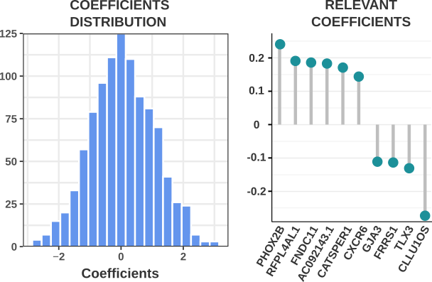
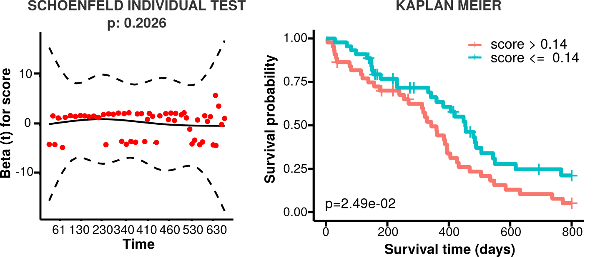
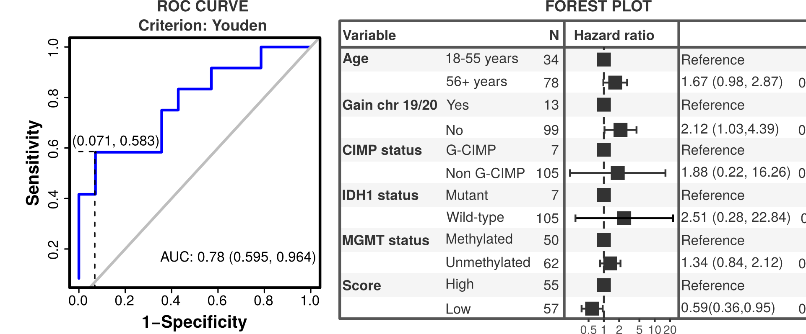

## Contents

1. [Overview](#overview)
2. [Installation](#installation)
3. [Dependencies](#dependencies)
4. [Commands and options](#commands-and-options)
5. [Finding signatures of genes or transcripts](#finding-signatures-of-genes-or-transcripts)
6. [Applying signatures of genes or transcripts in survival](#applying-signatures-of-genes-or-transcripts-in-survival)
7. [Integrative analysis](#integrative-analysis) 
6. [Toy example](#toy-example)
7. [Authors](#authors)

## Overview

Reboot is a flexible, easy-to-use algorithm to identify and validate genes or transcripts signatures whose expression are highly correlated with patient survival. This tool innovates by using a multivariate strategy with penalized Cox regression (Lasso method) combined with a bootstrap approach, presenting robust convergence of the regression procedure, and a variety of statistical testing for signature score. Reboot comprises two modules developed in R (version 3.6). The **regression** module provides functionality for obtaining gene/transcript signatures from a given set of samples. In turn, the **survival** module provides functionality for producing, applying and validating a score, which is calculated based on the obtained signature, in patient datasets. In this module, a different set of samples may be provided for validation purposes, and clinical variables may also be taken into account. Moreover, reboot also has the execution option **complete**, which integratively executes the two aforementioned modules.


*Reboot workflow: First module (regression) makes a regression analysis to identify a gene or transcript signature. The second module (survival) runs survival analysis of a score calculated based on the obtained signature.*

## Installation

Reboot can be obtained from Github and installed via a Docker container (recommended) or through direct installation.

1. Docker container
	
	This method works on any distribution or operational systems, as long as [Docker](https://docs.docker.com/install){:target="_blank"} is installed.

	```docker pull galantelab/reboot```

2. Direct installation

	This method requires the previous installation of  [R (version >= 3.6)](https://cran.r-project.org/doc/manuals/r-devel/R-admin.html){:target="_blank"}:

	```git clone https://github.com/galantelab/reboot.git```

	```sudo sh reboot/install.sh```

## Dependencies

In order to work properly, the following packages are necessary (included in the installation procedures):

* [argparse](https://cran.r-project.org/web/packages/argparse/index.html){:target="_blank"}
* [BiocManager](https://cran.r-project.org/web/packages/BiocManager/vignettes/BiocManager.html){:target="_blank"}
* [BioinformaticsFMRP/TCGAbiolinks](https://github.com/BioinformaticsFMRP/TCGAbiolinks){:target="_blank"} (from BiocManager)
* [data.table](https://cran.r-project.org/web/packages/data.table/index.html){:target="_blank"}
* [extrafont](https://cran.r-project.org/web/packages/extrafont/index.html){:target="_blank"}
* [forestmodel](https://cran.r-project.org/web/packages/forestmodel/index.html){:target="_blank"}
* [hash](https://cran.r-project.org/web/packages/hash/index.html){:target="_blank"}
* [OptimalCutpoints](https://cran.r-project.org/web/packages/OptimalCutpoints/index.html){:target="_blank"}
* [optparse](https://cran.r-project.org/web/packages/optparse/index.html){:target="_blank"}
* [penalized](https://cran.r-project.org/web/packages/penalized/index.html){:target="_blank"}
* [remotes](https://cran.r-project.org/web/packages/remotes/index.html){:target="_blank"} (from BiocManager)
* [R.utils](https://cran.r-project.org/web/packages/R.utils/index.html){:target="_blank"}
* [sjlabelled](https://cran.r-project.org/web/packages/sjlabelled/index.html){:target="_blank"}
* [sjmisc](https://cran.r-project.org/web/packages/sjmisc/index.html){:target="_blank"}
* [sjstats](https://cran.r-project.org/web/packages/sjstats/index.html){:target="_blank"}
* [survcomp](http://www.bioconductor.org/packages/release/bioc/html/survcomp.html){:target="_blank"} (from BiocManager)
* [survival](https://cran.r-project.org/web/packages/survival/index.html){:target="_blank"}
* [survivalROC](https://cran.r-project.org/web/packages/survivalROC/index.html){:target="_blank"}
* [survminer](https://cran.r-project.org/web/packages/survminer/index.html){:target="_blank"}
* [tidyverse](https://cran.r-project.org/web/packages/tidyverse/index.html){:target="_blank"}

## Commands and options 

Reboot works with a command and subcommands structure:

```reboot.R [subcommand] <options>```


Subcommands may be invoked by the help menu:

```bash
# for docker container
docker run --rm galantelab/reboot reboot.R -h
``` 

Optionally:


```bash
# for direct installation
reboot.R -h
```

Similarlly, version may be invoked by:

```bash
# for docker container
docker run --rm galantelab/reboot reboot.R -v
```

Optionally:


```bash
# for direct installation
reboot.R -v
```


In summary, 3 subcommands are available:


| **regression** | generates signature through multivariate Cox regression |
| **survival** | applies signature score in survival analysis |
| **complete** | generates a signature and applies its signature score in survival analysis| 

<br>

## Finding signatures of genes or transcripts

   Reboot searches for a genetic signature (significance coefficients) correlated with patient survival based on a multivariate Cox regression of genes or transcripts. This module uses a lasso algorithm combined with a Bootstrap approach for dealing with possible dimension vulnerability (especially whether it has high attributes or instances ratios). 

   Filters for minimal variability of the attributes are also implemented. Reboot analysis starts off by checking and removing attributes with variance lower than the defined cut-off. If a low variance follow up is detected or a OS status proportionality ratio greater than 80% or lower than 20% is found, the analysis is stopped and a warning returned due to possible convergence problems. Before starting the analysis, a schoenfeld filter is applied in a univariate way. Next, a spearman correlation filter is applied to every iteration of the Bootstrap process based on the settable fraction of pairs with correlation coefficient higher than 0.8 and a p-value lower than 0.05. 

   Coverage (Cv) may be introduced as the number of times an attribute is raffled, on average, after B iterations, according to the formula:

   Cv = (B * G) /  N

   Where (N) is the number of attributes (genes or transcripts) and (G) is the group size, i.e, the number of attributes to be included in each iteration. For optimal algorithm convergence, we recommend the group size (G) to be between 10 and 15 attributes per iteration. In order to assure a satisfying level of group combinations, our recommendation is to run each attribute in N/G simulations on average, in other words: Cv = N/G, which yields:

   B = (N / G)²
   
   For instance, when N is 100 and G is 10, the recommended number of bootstrap iterations would be 100 and, as a consequence, the number of appearances of each attribute would be 10, as exemplified in the following table:  

   | N | G | B | Cv |
   |----|----|----|----|
   |100|10|100|10|
   |300|15|400|20|
   |500|12|1736|42|

   <br>

   Regression analysis is performed approximately linearly in time in relation to the number of bootstrap iterations, if the analysis shouldn't take more than a period of the day we recommend a max of 10,000 iteractions
 
### Usage

    For gene or transcript signature obtention, run the following: 
   

   ```bash 
   # for docker container
   docker run --rm galantelab/reboot reboot.R regression <options>
   ```

   optionally:


   ```bash
   # for direct installation
   reboot.R regression <options>
   ```


   Regression options are: 

   <table width="600" cellspacing="0" cellpadding="0">
   <tr>
   <td width="30%"><b>Options</b></td>
   <td width="70%"><b>Description</b></td>
   </tr>
   <tr>
   <td>-I, --filein</td>
   <td>Input file name. Tab-separated values (.tsv) file containing genes or transcripts expression and survival parameters</td>
   </tr>
   <tr>
   <td>-O, --outprefix</td>
   <td>Output file prefix (string). Default: reboot</td>
   </tr>
   <tr>
   <td>-B, --bootstrap</td>
   <td>Number of iterations for bootstrap simulation (integer). Default: 1</td>
   </tr>
   <tr>
   <td>-G, --groupsize</td>
   <td>Number of genes or transcripts to be selected in each bootstrap simulation (integer). Default: 10</td>
   </tr>
   <tr>
   <td>-P, --pcentfilter</td>
   <td>Percentage of correlated gene or transcript pairs allowed in each iteration (double). Default: 0.3</td>
   </tr>
   <tr>
   <td>-V, --varfilter</td>
   <td>Minimum normalized variance (0-1) required for each gene or transcript among samples (double). Default: 0.01</td>
   </tr>
   <tr>
   <td>-F, --force</td>
   <td>Choose -F to bypass OS and OStime filters</td>
   </tr>
   <tr>
   <td>-h, --help</td>
   <td>Show this help message and exit</td>
   </tr>
   </table>

   <br>

### Input
		
   To produce a genetic signature, reboot requires a .tsv file containing normalized expression values in Transcripts Per Million (TPM) or in Fragments Per Kilobase per Million (FPKM) for genes or transcripts across multiple samples, in addition to survival data: survival status (e.g., 0=alive or 1=dead) and follow up time:

   | Sample ID | OS | OS.time | PARPBP | RAD51 | ... |   
   |---|---|---|---|---|---|
   | patient_1 | 1 | 448 | 41.81557 | 34.70869 | ... | 
   | patient_2 | 0 | 466 | 24.78227 | 64.80153 | ... |
   | ... | ... | ... | ... | ... | ... |

   <br>   

### Output

   As result, reboot generates one log file, a .tsv file containing regression coefficients and 2 plots. The .tsv file is in the following format:
	
   | Feature name | coefficient | 
   | --- | --- |
   | PARPBP | 0.17014 | 
   | CXCR6 | 0.22173 |
   | ... | ... |
 
   <br>

   The plots generated are a histogram with the distribution of the regression coefficients and a lollipop plot with the most relevant coefficients (see bellow).

   <br>
   <p align="center">
   
   </p>
   <br>

## Applying signatures of genes or transcripts in survival

   Reboot produces and applies a score for all samples based on the signature previously obtained from the **regression** module. Besides, reboot also offers the multivariate option, where further clinical variables (e.g., therapy, age and gender) can be loaded in a multivariate survival model. Multiple univariate analyses are performed and only variables with a p-value <= 0.2 are selected for the final multivariate model. Statistical tests are performed in order to evaluate the relevance of the signature score along with co-variables as prognostic factors of a given event (overall / progression-free / recurrence-free survival).

   By default, both univariate and multivariate survival analyses use the median score value as a cutoff to stratify patients in high and low score signatures. Alternatively, this cutoff value may be based on a Receiver Operator Characteristic (ROC) curve using Nearest Neighbour Estimate (NNE) method and the Youden statistics, where J = [sensitivity + (specificity -1)]. If more than one J coefficient is available, then the first one is chosen.

   If a multivariate analysis is performed based on a ROC curve, a bootstrap resampling method is applied once the provided clinical dataset passes the filters: (i) final dataset with at least 70% of the original one (Not Available - NA filter) and; (ii) the frequency of the less abundant category for each co-variable is not less than 20% (proportion filter). Otherwise, the multivariate analysis is performed without the bootstrap method. After 100 iterations, the relevance frequency of each co-variable with the event is calculated.

### Usage

   To validate a signature of genes or transcripts in survival analysis, run the following:

   ```bash
   # for docker container
   docker run --rm galantelab/reboot reboot.R survival <options>
   ```

   Optionally:

   ```bash
   # for direct installation
   reboot.R survival <options>
   ```


   Survival options are:

   <table width="600" cellspacing="0" cellpadding="0">
   <tr>
   <td width="30%"><b>Options</b></td>
   <td width="70%"><b>Description</b></td>
   </tr>
   <tr>
   <td>-I, --filein</td>
   <td>Input file name. Tab-separated values (.tsv) file containing genes or transcripts expression and survival parameters</td>
   </tr>
   <tr>
   <td>-O, --outprefix</td>
   <td>Output file prefix (string). Default: reboot</td>
   </tr>
   <tr>
   <td>-M, --multivariate</td>
   <td>If clinical variables should be included, choose -M. This option is tied with -C option. Default: FALSE</td>
   </tr>
   <tr>
   <td>-C, --clinical</td>
   <td>Tab-separated values (.tsv) file containing binary categorical variables only. Required if -M option is chosen |</td>
   </tr>
   <tr>
   <td>-R, --roc</td>
   <td>To categorize the genetic score according to a ROC curve instead of median value, choose -R. Default: FALSE</td>
   </tr>
   <tr>
   <td>-S, --signature</td>
   <td>Tab-separated values (.tsv) file containing a set of genes or transcripts and corresponding cox coefficients</td>
   </tr>
   <tr>
   <td>-F, --force</td>
   <td>Choose -F to bypass OS and OStime filters</td>
   </tr>
   <tr>
   <td>-h, --help</td>
   <td>Show this help message and exit</td>
   </tr>
   </table>

   <br>
 
### Inputs

   Survival analyses may be run in univariate or multivariate mode. Required inputs depend on this choice.

   1. Univariate mode
       
      This is the simplest mode and requires a single input file. The expected .tsv file contains a set of features (genes/transcripts) and their corresponding coefficients provided as output by the **regression** module:


      | Feature name | coefficient |
      | --- | --- |
      | PARPBP | 0.17014 |
      | CXCR6 | 0.22173 |
      | ... | ... |

      <br>      
    
   2. Multivariate mode

      In case multivariate mode is chosen, a .tsv file containing clinical information is also necessary. Note that all clinical variables MUST be categorical and present ONLY 2 classes (NA values are allowed):

      | Sample ID | age | gender | therapy | ... |   
      |---|---|---|---|---|
      | patient_1 | 18-55 years | male | radiation | ... | 
      | patient_2 | 56+ years | female | chemoradiation | ... |
      | ... | ... | ... | ... | ... |

      <br>

### Outputs

   Depending on whether survival analysis was performed in univariate or multivariate mode, a different set of output files are created.

   1. Univariate mode

      If the analysis is performed in univariate mode, reboot returns a log and a **lograng.txt** file, containing the survival results for the signature score:

      <table width="600" cellspacing="0" cellpadding="0">
      <tr>
      <td width="10%"><b>feature</b></td>
      <td width="10%"><b>coefficient</b></td>
      <td width="20%"><b>hazard.ratio</b></td>
      <td width="10%"><b>log.rank.pvalue</b></td>
      <td width="10%"><b>low.high.samples</b></td>
      <td width="15%"><b>median.survival.low</b></td>
      <td width="15%"><b>median.survival.high</b></td>
      <td width="10%"><b>prognosis</b></td>
      </tr>
      <tr>
      <td>score</td>
      <td>-1.0091</td>
      <td>0.3645 (95% CI, 0.2456-0.541)</td>
      <td>0.003</td>
      <td>52/53</td>
      <td>532 (95% CI, 455-648)</td>
      <td>313 (95% CI, 231-362)</td>
      <td>better</td>
      </tr>
      </table>

      <br>
       
      Plots returned in this mode include: a proportional hazard assumptions plot (result of Schoenfeld test) and a Kaplan Meier plot (see bellow).

      

   2. Multivariate mode
 
      If the analysis is performed in multivariate mode, reboot returns all files created in the univariate mode in addition to a **multicox.txt** file, which contains the survival results of the signature score along with all other clinical variables:

      <table width="600" cellspacing="0" cellpadding="0">
      <tr>
      <td width="10%"><b>variable</b></td>
      <td width="10%"><b>reference</b></td>
      <td width="20%"><b>univariate.hazard.ratio</b></td>
      <td width="10%"><b>univariate.Cox.pvalue</b></td>
      <td width="10%"><b>univariate.prognosis</b></td>
      <td width="20%"><b>multivariate.hazard.ratio</b></td>
      <td width="10%"><b>multivariate.Cox.pvalue</b></td>
      <td width="10%"><b>multivariate.prognosis</b></td>
      </tr>
      <tr>
      <td>score</td>
      <td>low</td>
      <td>0.3645 (95% CI, 0.2456-0.541)</td>
      <td>0.001</td>
      <td>better</td>
      <td>0.3904 (95% CI, 0.2248-0.6779)</td>
      <td>8e-04</td>
      <td>better</td>
      </tr>
      <tr>
      <td>age</td>
      <td>56+ years</td>
      <td>1.369 (95% CI, 0.9086-2.0625)</td>
      <td>0.1332</td>
      <td>worse</td>
      <td>1.1104 (95% CI, 0.6314-1.9531)</td>
      <td>0.7161</td>
      <td>----</td>
      </tr>
      <tr>
      <td>gender</td>
      <td>MALE</td>
      <td>0.9474 (95% CI, 0.6381-1.4066)</td>
      <td>0.7886</td>
      <td>----</td>
      <td>----</td>
      <td>----</td>
      <td>----</td>
      </tr>
      <tr>
      <td>...</td>
      <td>...</td>
      <td>...</td>
      <td>...</td>
      <td>...</td>
      <td>...</td>
      <td>...</td>
      <td>...</td>
      </tr>
      </table>

      <br>

      Plots returned in this mode include a forest plot for all clinical variables, a Kaplan Meier plot, and a proportional hazard assumptions plot (Schoenfeld tests). If the option --ROC is selected, only relevant variables (p-value <= 0.05 in at least 25% of iterations) are plotted. A ROC curve and a plot of co-variable frequencies are also provided (see bellow).

      

## Integrative analysis

   Reboot also provides a subcommand to perform the full analyses (**regression** followed by **survival**) in a one-step process. To execute it, run the following:


   ```bash
   # for docker container
   docker run --rm  galantelab/reboot reboot.R complete <options>
   ```

   Optionally:


   ```bash
   # for direct installation
   reboot.R complete -h
   ```


   Complete options are:

   <table width="600" cellspacing="0" cellpadding="0">
   <tr>
   <td width="30%"><b>Options</b></td>
   <td width="70%"><b>Description</b></td>
   </tr>
   <tr>
   <td>-I, --filein</td>
   <td>Input file name. Tab-separated values (.tsv) file containing genes or transcripts expression and survival parameters</td>
   </tr>
   <tr>
   <td>-O, --outprefix</td>
   <td>Output file prefix (string). Default: reboot</td>
   </tr>
   <tr>
   <td>-B, --bootstrap</td>
   <td>Number of iterations for bootstrap simulation (integer). Default: 1</td>
   </tr>
   <tr>
   <td>-G, --groupsize</td>
   <td>Number of genes or transcripts to be selected in each bootstrap simulation (integer). Default: 10</td>
   </tr>
   <tr>
   <td>-P, --pcentfilter</td>
   <td>Percentage of correlated gene or transcript pairs allowed in each iteration (double). Default: 0.3</td>
   </tr>
   <tr>
   <td>-V, --varfilter</td>
   <td>Minimum normalized variance (0-1) required for each gene or transcript among samples (double). Default: 0.01</td>
   </tr>
   <tr>
   <td>-M, --multivariate</td>
   <td>If clinical variables should be included, choose -M. This option is tied with -C option. Default: FALSE</td>
   </tr>
   <tr>
   <td>-C, --clinical</td>
   <td>Tab-separated values (.tsv) file containing binary categorical variables only. Required if -M option is chosen</td>
   </tr>
   <tr>
   <td>-R, --roc</td>
   <td>To categorize the genetic score according to a ROC curve instead of median value, choose -R. Default: FALSE</td>
   </tr>
   <tr>
   <tr>
   <td>-F, --force</td>
   <td>Choose -F to bypass OS and OStime filters</td>
   </tr>
   <td>-h, --help</td>
   <td>Show this help message and exit</td>
   </tr>
   </table>

   <br>

## Toy example

   In order to illustrate how easy is to use reboot, we produce a framework to get a small dataset (here called toy dataset) from [TCGA](https://www.cancer.gov/about-nci/organization/ccg/research/structural-genomics/tcga){:target="_blank"} and use it into reboot.

   We provide a script to download and format gene expression and clinical data of glioblastoma patients from TCGA. It can be run following this command into the reboot directory:
	
   ```bash
   # for docker container
   docker run --env MYID=$(id -u) --rm -ti -v $(pwd):$(pwd) -w $(pwd) galantelab/reboot toyfordocker.R
   ```

   optionally:


   ```bash
   # for direct usage
   toyscript.R
   ``` 

   This command returns 2 .tsv files, mentioned above, called expression.tsv and clinical.tsv. A MANIFEST.txt file and a set of expression and clinical data are also created, as intermediates of TCGA download process.
   The composition of expression dataset comprises clinical variables: OS (survival status) and OS.time (follow up time) and 50 random picked gene expression (FPKM).

   Finally, reboot can be run in the complete mode:

   ```bash
   # for docker container
   docker run -u $(id -u):$(id -g) --rm -v $(pwd):$(pwd) -w $(pwd) galantelab/reboot reboot.R complete -I expression.tsv -O toy -B 100 -G 10 -M -C clinical.tsv -F
   ```

   Optionally:


   ```bash
   # for direct usage
   reboot.R complete -I expression.tsv -O toy -B 100 -G 10 -M -C clinical.tsv -F
   ```    
## Authors

   Felipe Rodolfo Camargo dos Santos*

   Gabriela Der Agopian Guardia*

   Filipe Ferreira dos Santos	

   Pedro Alexandre Favoretto Galante
 
   *These authors contributed equally for the work

[Back to top](#contents)
