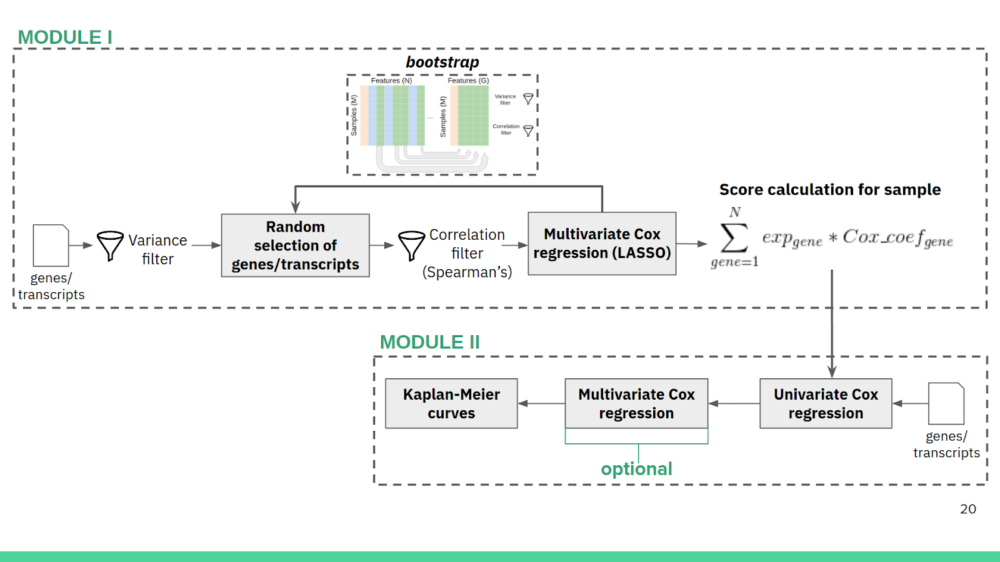

## Outline

1. Overview
2. Installation
3. Dependencies
4. Usage and options
5. Inputs
6. Toy example 
7. Outputs

## Overview

Reboot is a modular tool, comprising two main functionalities: regression and survival.
It was built to provide the freedom of choice for regression and survival analysis; only regression analysis; or only survival analysis



## Installation
Reboot can be obtained from github and run locally, this method requires all dependencies to be installed previously:

```git clone git@github.com:galantelab/Reboot.git```

Reboot is also available in a docker image, ready to be used, contemplating all dependecies (this option is indicated):

```docker pull galantelab/reboot```

## Dependencies

Reboots is built in R scripts. In order to work properly, the following packages are necessary (provided by docker environment):

* survival
* survminer
* BiocManager
* survcomp
* optparse
* OptimalCutpoints
* survivalROC
* forestmodel
* sjstats
* data.table
* penalized
* tidyverse
* hash
* R.utils
* argparse
* extrafont
* remotes (from BiocManager)
* BioinformaticsFMRP/TCGAbiolinks (from BiocManager)

## Usage and options 

1. Main options

   Main options are regression, survival or complete and can be invoked by the help menu:

   ```Rscript reboot.R -h```

   The same can be performed in a docker container:

   ```docker run --rm galantelab/reboot -h```

   In summary, options are:

   | signature | generates signature through multivariate cox regression analys |
   | survival | applies sgnature in survival analysis |
   | complete | generates and applies signature | 
 
   <br>

2. Regression option

   All sub-options are provided by: 

   ```Rscript reboots.R regression -h```


   If you are using docker container:

   ```docker run --rm galantelab/reboot regression -h```

   In summary, options are: 

   | short flag | full flag | Description|
   | ------ | ------ | ------ |
   | -I<br> | - -filein | Input file name. Tab separated values (tsv) file containing genes/transcripts expression and survival paramenters|
   | -O<br> | - -outprefix |  Output file prefix. Default: reboot |
   | -B<br> | - -bootstrap | Number of iterations for bootstrap simulation (int). Default: 1 |
   | -G<br> | - -groupsize | Number of genes/transcripts to be selected in each bootstrap simulation (int). Default: 3 |
   | -P<br> | - -percentagefilter | Percentage of correlated gene/transcript pairs allowed in each iteration. Default: 0.3 |
   | -V<br> | - -variancefilter | Minimum normalized variance (0-1) required for each gene/transcript among samples (double). Default: 0.01 |

   <br>	

3. Survival option

   All sub-options are provided by:

   ```Rscript reboot.R survival -h```


   If you are using docker container:

   ```docker run --rm galantelab/reboot survival -h```


   In summary, options are:

   | -I | --filein | Input file name. Tab separated values (tsv) file containing genes/transcripts expression and survival paramenters|
   | -O | --outprefix |  Output file prefix. Default: reboot |
   | -M | --multivariate | If clinical variables should be included, choose -M. This option is tied with -C option |
   | -C | --clinical | Tab separated values (tsv) file containing binary categorical variables only. Required if -M option is chosen |
   | -R | --roc | If continuous variables should be categorized according to a ROC curve instead of median, choose -R |
   | -S | --signature | Tab separated values (tsv) file containing a set of genes/transcripts and corresponding cox coefficients |

   <br>

4. Complete option

   All sub-options are provided by: (give a more detailed table after command)

   ```Rscript reboots.R complete -h```

   If you are using docker container:

   ```docker run --rm  galantelab/reboot complete -h```

   In summary, options are:

   | -I | --filein | Input file name. Tab separated values (tsv) file containing genes/transcripts expression and survival paramenters|
   | -O | --outprefix |  Output file prefix. Default: reboot |
   | -B | --bootstrap | Number of iterations for bootstrap simulation (int). Default: 1 |
   | -G | --groupsize | Number of genes/transcripts to be selected in each bootstrap simulation (int). Default: 3 |
   | -P | --percentagefilter | Percentage of correlated gene/transcript pairs allowed in each iteration. Default: 0.3 |
   | -V | --variancefilter | Minimum normalized variance (0-1) required for each gene/transcript among samples (double). Default: 0.01 |
   | -M | --multivariate | If clinical variables should be included, choose -M. This option is tied with -C option |
   | -C | --clinical | Tab separated values (tsv) file containing binary categorical variables only. Required if -M option is chosen |
   | -R | --roc | If continuous variables should be categorized according to a ROC curve instead of median, choose -R |

   <br>

## Inputs
		
1. It is required quantitative information of atributes, including status and follow up time which must be in tsv format. This file is required for both regression and survival analysis:

   | Sample ID | OS | OS.time | Feature1 | Feature2 | ... |   
   |---|---|---|---|---|---|
   | Sample1 | OS status | OS.time value | Feature1 value | Feature2 value | ... | 
   | Sample2 | OS status | OS.time value | Feature1 value | Feature2 value | ... |
   | ... | ... | ... | ... | ... | ... |

   <br>

2. In case survival option is invoked, clinical information is also necessary in a tsv format, in the following configuration (all clinical variables MUST be categorical and present ONLY 2 classes):

   | Sample ID | clinical_variable1 | clinical_variable2 | clinical_variable3 | ... |   
   |---|---|---|---|---|
   | Sample1 | clin_var1(status) | clin_var2(status) | clin_var3(status) | ... | 
   | Sample2 | clin_var1(status) | clin_var2(status) | clin_var3(status) | ... |
   | ... | ... | ... | ... | ... |

   <br>

## Toy example

   In order to ilustrate usage, a toy script is provided to download and format expression and clinical data of glioblastoma patients from TCGA.
   Running the following code in the reboot directory provides both inputs:
	
   ```Rscript toyscript.R```

   It is also possible to obtain toy datasets from reboot docker image, using the following:

   ```docker run --rm --entrypoint=["Rscript", "/reboot/toyscript.R"] galantelab/reboot```

   This command returns 2 tsv files, mentioned above, called expression.tsv and clinical.tsv
   The composition of expression dataset comprises clinical variables: OS (survival status) and OS.time (follow up time) and 50 random picked gene expression (FPKM).

   Finally, reboots can be run in the complete mode:

   ```Rscript reboot.R complete -I expression.tsv -O toy -B 100 -G 10 -M -C clinical.tsv -R```

   Docker:
   
   ```docker run -u $(id -u):$(id -g) --rm -ti -v $(pwd):$(pwd) -w $(pwd) galantelab/reboot complete -I expression.tsv -O toy -B 100 -G 10 -M -C clinical.tsv -R```
    
## Outputs
 
   1. The regression option

   Generated outputs comprise 1 text file and 2 plots. The text file is in the follwing format:
	
   | Feature name | coefficient | 
   | --- | --- |
   | Feature1 | coefficient1 | 
   | Feature2 | coefficient2 |
   | ... | ... |

   The plots in the output are a histogram with the distribution of the coefficients and a lollipop plot with the most relevant coefficients


2. The survival option


3. The complete option

